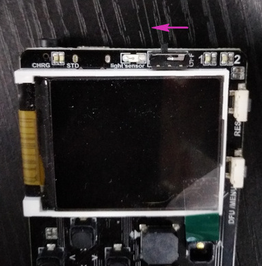
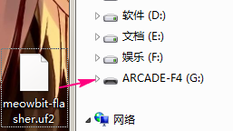
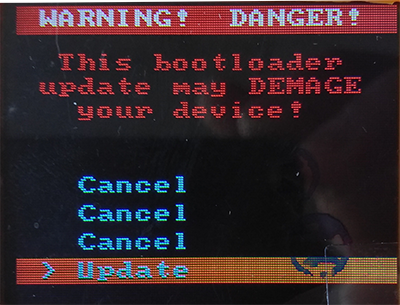
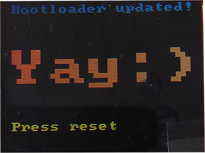

# Upgrade bootloader  {docsify-ignore-all}

## The latest version

v2.7.0： https://cdn.kittenbot.cn/meowbit/meowbit-flasher.uf2

## Steps

1. you must have a computer with Windows or Linux,then connect the meowbit with USB    

`please make sure the switch is on`   

  

2. drag the file you download into the diver letter  
`maybe the name you see is not as the same ,but you know that`
 

3. follow the steps below  

   

 

`Press the reset button as prompted`

4. Finally, when you see this interface, you have already succeeded. 

 